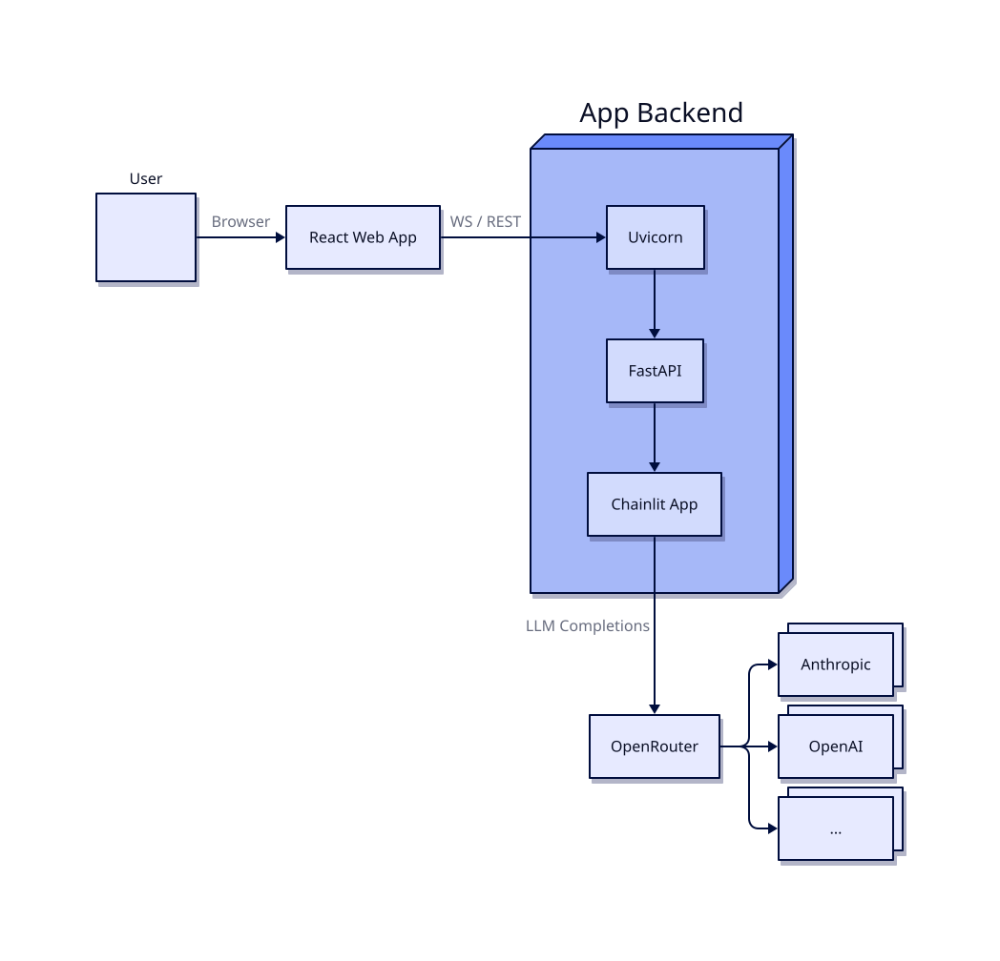

# `01-getting-started`
This chapter requires a working installation of `uv` and a virtual environment (ideally located at `.venv/`) in this folder.

# Exercises
1. **Generation statistics** You can configure Chainlit to render HTML directly in a Message. Edit the settings in `.chainlit/config.toml` to enable showing HTML and write a helper function `add_stats` that counts the emitted tokens and records the length of time required from start-to-finish for answer generation. This function should style a short message that is appended to the end of every LLM response that shows how long it took to generate and the number of tokens generated.

2. **Logging levels** use the `logging` library at `INFO` level for the following:
  - Show one logging message for application startup (after imports, outside of the @-decorated functions) to report on the model use dby the app as well as the base URL
  - Show a logging message that reports on the user session ID via `{cl.user_session.get('id')}` in `on_chat_start`
  - Add a logging message for `on_message` which reports the number of tokens and time elapsed.

3. Add a check for `config.api_key` to make sure it is not None or `''` at startup, and exit the application with an error message if it is. Note that you can test this condition using just `if config.api_key:`.

4. Currently, this system does not support multi-turn conversation because only the most recent message is used to call the LLM. The `history` variable should instead look like the following with alternate mesages from `user` and `assistant`
```
[ 
  {"role": "user", "content": '...'},
  {"role": "assistant", "content": '...'},
  {"role": "user", "content": '...'}
]
```
Edit the `cl.user_session` to store a value labeled "history" which contains these alternating messages. 

